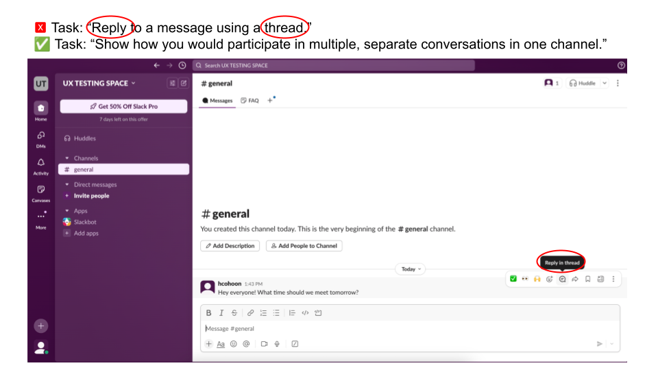
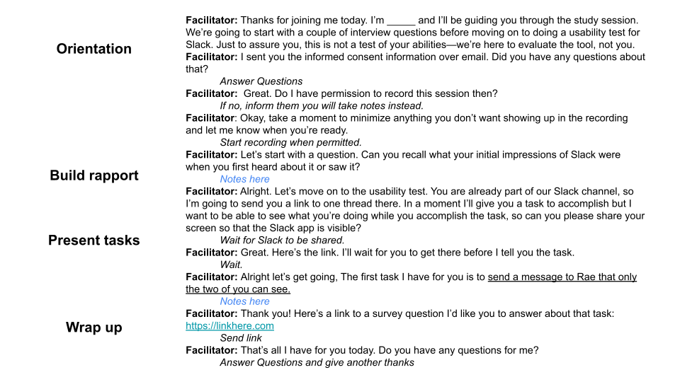

:::::::::::::::::::::::::::::::::::::: questions 

- What makes a good task for rapid usability testing?
- What metrics are typically used in rapid usability testing?
- How do I structure a participant’s session?
- What should I say to my participants?
- What is pilot testing?
  
::::::::::::::::::::::::::::::::::::::::::::::::

::::::::::::::::::::::::::::::::::::: objectives

- Articulate task prompts for rapid usability test
- Determine metrics for addressing your research question
- Develop a usability test script
- Prepare a usability test environment
- Describe the benefits and risks of a pilot study

::::::::::::::::::::::::::::::::::::::::::::::::

## Defining tasks for rapid usability testing
A task should be something that users actually want to do that can be accomplished in a short period of time. When defining tasks for your rapid usability test, keep in mind that you usually don’t want to test users’ reading comprehension—you want to test the usability of the interface. Thus, avoid using terms visible in the interface in your task description. Nielsen Norman [has additional advice](https://www.nngroup.com/articles/better-usability-tasks/) on how to craft good task prompts. 

### Example: Being goal oriented and avoiding language from the user interface
{alt="A screenshot of Slack that shows 'Reply in thread' as tooltip content."}

After you’ve selected tasks for your usability study, time yourself completing study tasks to establish a baseline. To prevent fatigue, you want to aim for your session to be under 30 minutes. Allowing 10 minutes for non-task activities like instructions and interview questions means you should have no more than 20 minutes for task completion. Reduce the number or complexity of tasks you have planned if needed.

## Selecting your evaluation criteria
To answer your research questions, you need metrics. Determine what these will be before you start collecting data. The number and choice of metrics will be a judgment call only you and your team can make. Metrics might be countable and observable things like seconds or minutes, number of clicks, or number of errors. Metrics could also be gathered via a survey question that uses a scale, such as confidence on a scale (1, not at all confident – 5, completely confident) or level of agreement that the tool has the needed functionality (1, strongly disagree – 5, strongly agree). 

:::::::::::::::::::::::::::::::::::::: challenge
### Exercise 3: Evaluating ease
Assume you wanted to know how easy it is for Slack users to send threaded replies. You will assign users the task, “Show how you would participate in multiple, separate conversations in one channel.” 

In the Zoom poll, choose two metrics from below that you could use in your study.

| Metric |
| ------ |
| **Successes:** Number of participants who successfully complete a task. |
| **Errors:** Number of mistakes made while attempting a task, possibly broken down by error type. |
| **Clicks:**  Number of clicks participants make when completing a task; a proxy for complexity or efficiency. |
| **Completion time:** Time taken to complete a task. |
| **Idle time:** Periods of inactivity during a task, indicating confusion or hesitation. |
| **Drop-off rate:** Percentage of participants who stop a task before completing it. |
| **Self-reported ease:** Participants’ rating of how easy or difficult a task was to complete. |
| **Self-reported satisfaction:** Participants’ rating of how satisfied they are with the interface or experience. |
| **Self-reported usefulness:** Participants’ rating of how useful the tool or service is. |

:::::::: solution
Successes, errors, and self-reported ease are fairly natural choices here but the choice of metrics is up to you and depends on what you want to know about. Some metrics like clicks or idle time might be easier to collect with specialized software but a screen recording can get you pretty far. 
::::::::
::::::::::::::::::::::::::::::::::::::

Because you are likely evaluating success or counting errors, you should define what success looks like. Just like there are multiple ways to make errors, there may be multiple ways of achieving success.

### Example: Success and Errors can mean multiple things
Given a single task (“Show how you would participate in multiple, separate conversations in one channel”), success can still be achieved in multiple ways:
{alt="A screenshot of Slack that shows someone tagging another person in a comment and another person replying in a thread."}

## Developing a script
It is important that you give each of your participants the same experience when they join your study, so that results are comparable across participants. You want to avoid giving hints or causing confusion. You also want participants to feel comfortable talking with you. Following a script and prepping the test environment will make sure you succeed in these goals. The script should cover everything you’ll say to a participant so that someone else can stand in for you and still run the exact same study. 

### Example: Script for a study investigating the ease of sending direct messages
{alt="A script for an interview shown along side four phases: orientation, rapport building, presenting tasks, and wrap up."}

### Example: Asking survey questions with anonymous IDs
Often, when verbally asked a question that uses a Likert style scale (e.g., “On a scale of one to five, how easy was this task for you?”), participants will hesitate to provide a number and might give a more expansive answer. We recommend sending [self-report questions](https://docs.google.com/document/d/17ojRiqvnWwkDYMTYNXFed0BcuZnLZEyTCpsh_Rl2bcU/edit?tab=t.0#heading=h.1hjb3shsggu) like this as survey questions instead of asking them out loud. Google Forms are a simple way to do this. 

{alt="A screenshot of Google Forms showing two questions: What is your participant ID? and Overall the task was 'blank.' The second question has the option to respond on a 1-5 scale of very easy to very difficult."}

After you have prepared your script, ask someone to help you pilot (i.e., test out) your study. Ideally you would do this pilot with someone who would make a good participant, but that benefit should be balanced against the need to include eligible people in your actual study. Run the pilot session exactly as you would a real session and keep track of any needed changes to your script; it’s very important that the tasks themselves are easily understood. This is also an opportunity to ensure the study takes an appropriate amount of time. Run multiple pilots if needed.

::::::::::::::::::::::::::::::::::::: keypoints 
- Rapid usability testing should involve observing participants for no more than an hour, preferably less than 30 minutes. Choose the number of tasks you ask participants to complete based on your priorities and how much time you have available.
- Task prompts should be goals users might have and should not use language visible in your user interface.
- Evaluation criteria should be determined in advance. Multiple criteria can be used to evaluate a single concept like ease of use.
- Without specialized software, capturing some data like clicks or idle time may be difficult. However, many other common metrics are relatively simple to evaluate if you can record a session and/or present survey questions. If you are evaluating a command line tool, you may ask participants to copy their terminal contents and email them to you at the end of the session.
- When asking participants survey questions, do not do so verbally. Make sure you have a way of associating their anonymous response with their recorded session; anonymous participant IDs are a good choice.
- Preparing a script and the test environment ensures you run the same test with each participant and helps make sure you gather all the data you meant to.
- Your test sessions should begin with some orientation and rapport building, then move on to the tasks before wrapping up.
    - During orientation, introduce yourself and outline what will happen during the study. Reassure participants that they are not being tested—only the tool is being evaluated.
    - When building rapport, ask the participant a question about themselves that they can confidently answer.
    - When presenting the tasks, try to order them so that your most prioritized tasks go first, ensuring you get to them. If there is a logical sequence to them, you might apply that structure instead.
    - In your script, include links to any appropriate webpages or survey questions so you can easily share this information with participants; put them next to the appropriate task, not at the top of the page. 
- You will need to link any anonymous survey responses to their study session. A simple way is to assign each participant an ID number and tell them this ID number before sending them the survey; they can then enter that into the survey.
- Piloting your study helps ensure you have accurate estimates of how long a session will take, helps refine your script and environment set-up, and can inspire additional questions or tasks to include. However, if you anticipate difficulty recruiting, you should limit your piloting so that you don’t practice with too many potential actual participants.

::::::::::::::::::::::::::::::::::::::::::::::::
